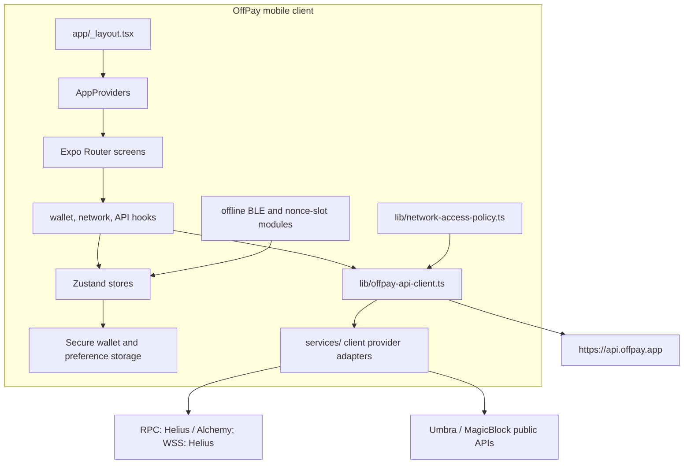

# OffPay

OffPay is an Expo Router React Native wallet client for iOS, Android, and static web output. Chain, wallet, Umbra, private payment, stream, and offline helper paths run client-side through the local provider boundary in `services/`; protected Jupiter, pending backup, and temporary bootstrap calls still go to `https://api.offpay.app`.

## Current Stack

- App runtime: Expo SDK 54, React Native 0.81.5, React 19.1, Expo Router 6.
- Language and state: TypeScript 5.9, Zustand, TanStack Query.
- Device storage and security: Expo SecureStore, Expo Local Authentication, app lock state.
- Wallet and chain libraries: `@solana/web3.js`, `@scure/bip39`, `@noble/curves`, `bs58`, `@umbra-privacy/sdk`.
- Device capabilities: QR generation, camera, Bluetooth/BLE, clipboard, file system, splash screen.

## Documentation

- [Client Documentation Index](documentation/README.md)
- [Architecture](documentation/architecture.md)
- [API And Auth Contract](documentation/api-and-auth.md)
- [Private Payments](documentation/private-payments.md)
- [Umbra SDK Usage](documentation/umbra-sdk-usage.md)
- [Wallet, Offline, And Security](documentation/wallet-offline-security.md)
- [Build And Testing](documentation/build-and-testing.md)

## Architecture



## App Entry And Providers

- `app/_layout.tsx` installs the network access policy, loads app fonts, hydrates wallet state, resolves onboarding routing, mounts the JavaScript stack, and displays the global route/network loader.
- `providers/AppProviders.tsx` wraps the app with `SafeAreaProvider`, `QueryClientProvider`, toast state, OffPay bootstrap, and OffPay launch orchestration.
- `providers/OffpayBootstrapProvider.tsx` resets OffPay API signing state when wallet/network identity changes and wires auth recovery to a fresh bootstrap provision.

## Routing Surface

- Tab routes live under `app/(tabs)/`: home, scanner, swap, history, and settings.
- Top-level wallet routes include onboarding, username setup, create wallet, restore wallet, security setup, accounts, holdings, token details, transaction details, private payment, receive payment, nearby wallet scanner, advanced swap, and Umbra privacy.
- Reusable UI is split between `components/ui/` and feature folders under `components/features/`.

## Wallet And API Auth

- `lib/wallet.ts` creates and restores Solana wallets using BIP39 and Ed25519 derivation path `m/44'/501'/0'/0'`.
- `lib/secure-wallet-store.ts` owns wallet secret persistence; `store/walletStore.ts` keeps active-wallet UI state and public keys.
- `lib/offpay-api-client.ts` bootstraps request auth through `/api/bootstrap/provision`, stores a per-device request secret, signs protected swap/pending/bootstrap calls, and delegates direct chain/service flows to `services/`.
- Protected API calls include `X-Wallet-Address`, `X-Timestamp`, `X-Signature`, `X-App-HMAC`, `X-App-Version`, `X-Device-Id`, `X-Network`, and `X-Bootstrap-Version`.

## Network And Offline Behavior

- `constants/networks.ts` exposes `mainnet-beta` and `devnet`; the client maps those to OffPay API and provider-router networks `mainnet` and `devnet`.
- The default UI network is `mainnet-beta`.
- Manual offline mode blocks non-loopback HTTP(S) fetches and marks TanStack Query offline.
- `useWalletModeState()` falls back to offline mode when NetInfo reports the network is not reachable.
- Provider endpoint URLs are Expo `EXPO_PUBLIC_*` client config. Treat them as public and protect them with provider-side secure URLs, allowlists, method restrictions, and usage limits.

## Environment

- Local environment values live in `.env`, which is ignored by git.
- `.env.example` is committed as the client-side template for provider endpoints, Umbra endpoints, MagicBlock validator allowlists, attestation mode, and the retained OffPay API origin.
- EAS builds need the same `EXPO_PUBLIC_*` names configured in EAS environment variables because these values are bundled as public client config.

## Backend And Provider Surfaces Used

`lib/offpay-api-client.ts` contains the current client contract:

- capabilities: local static config from `services/capabilities/index.ts`
- wallet data and activity: direct Helius RPC/WSS with Alchemy RPC fallback
- pending backups: `/api/pending/backup`
- swaps: `/api/swap/*`
- private payments and settlement: direct MagicBlock/public-provider preparation plus client provider broadcast
- Umbra indexer/relayer reads: direct client calls
- Solana RPC: Helius primary with Alchemy fallback
- Solana WSS: Helius only
- offline nonce/token helpers: direct client provider router

## Native Configuration

- App identity: name `OffPay`, slug `offpay`, scheme `offpay`.
- iOS bundle identifier and Android package: `com.offpay.app`.
- Expo new architecture is enabled.
- Bluetooth permissions are configured for offline payment receipt transport.
- EAS project id is `27e2bc20-d53b-4237-8123-fdc22176e56b`.
- `development` and `preview` EAS profiles set `EXPO_PUBLIC_OFFPAY_ATTESTATION_MODE=prototype`; `preview` builds an Android APK.

## Verification Commands

Available scripts in `package.json`:

```bash
npm test
npm run test:all
npm run lint
npm run typecheck
npm run verify:hardening
```

`npm start`, `npm run android`, `npm run ios`, and `npm run web` start local Expo workflows. Do not run local server commands from agent sessions unless explicitly allowed by the repository instructions.

## Project Structure

```text
app/          Expo Router screens
components/   shared UI and feature UI
constants/    theme, spacing, currencies, networks, offline slot constants
hooks/        React Query and app behavior hooks
lib/          wallet, API, offline, BLE, signing, storage, and utility modules
providers/    app-level React providers
store/        Zustand stores
types/        shared TypeScript contracts
```

## License

MIT
