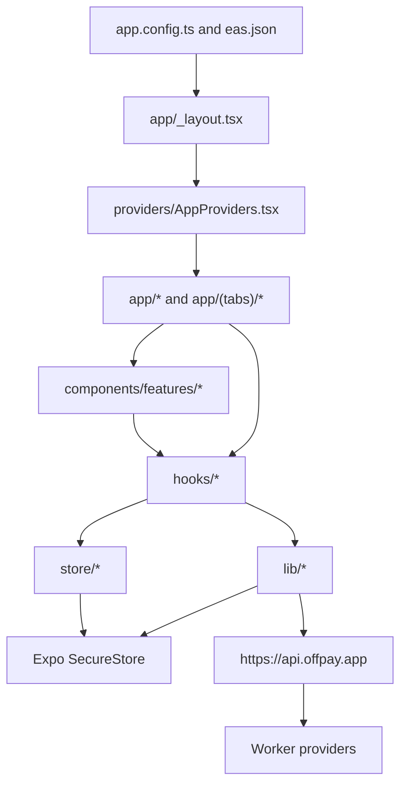

# OffPay Client Documentation

This directory documents the current client app from tracked source files. Details are scoped to code in `app/`, `components/`, `constants/`, `hooks/`, `lib/`, `providers/`, `store/`, `types/`, `workers/`, `app.config.ts`, `eas.json`, and `package.json`.

## Index

- [Architecture](architecture.md): app shell, providers, screens, stores, and data flow.
- [API And Auth Contract](api-and-auth.md): Worker origin, request signing, bootstrap, and provider route groups used by the app.
- [Agentic Payments System Design](agentic-payments-system-design.md): client-led AI wallet agent plan using app repo backend adapters, with a thin hosted AI/voice key-proxy only.
- [Private Payments](private-payments.md): online MagicBlock/private-payment flow, verification, fallback queueing, and offline branch.
- [Umbra SDK Usage](umbra-sdk-usage.md): Umbra client setup, client RPC adapters, signer flow, supported tokens, and vault actions.
- [Wallet, Offline, And Security](wallet-offline-security.md): wallet storage, offline mode, BLE/offline payments, and app lock surfaces.
- [Build And Testing](build-and-testing.md): native config, EAS profiles, and verification scripts.

## App Map

## Source Of Truth

- Routing: `app/_layout.tsx`, `app/(tabs)/_layout.tsx`, and route files under `app/`.
- App providers: `providers/AppProviders.tsx`, `providers/OffpayBootstrapProvider.tsx`, `providers/OffpayLaunchProvider.tsx`.
- Backend and provider contract: `lib/api/offpay-api-client.ts`, `lib/crypto/offpay-api-auth.ts`, `workers/api/`, `types/offpay-api.ts`.
- Wallet and secure storage: `lib/wallet.ts`, `lib/secure-wallet-store.ts`, `store/walletStore.ts`.
- Offline behavior: `lib/network-access-policy.ts`, `hooks/useWalletModeState.ts`, `lib/offline-payments.ts`, `lib/offline-payment-slots.ts`, `lib/offline-ble-*`.
