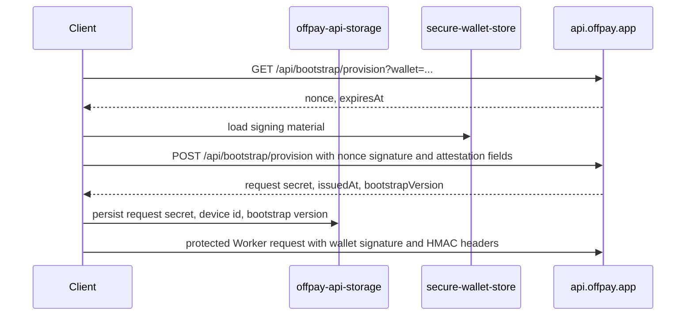
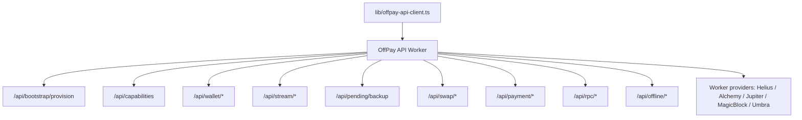

# API And Auth Contract

The client sends OffPay backend traffic through the configured API Worker custom domain from `lib/api/offpay-api-client.ts`. Chain, wallet, stream, Umbra, private payment, offline helper, swap, bootstrap, and pending-backup paths route through the Worker.

## Auth Flow

## Protected Headers

`lib/offpay-api-auth.ts` builds these headers for protected requests:

- `X-Wallet-Address`
- `X-Timestamp`
- `X-Signature`
- `X-App-HMAC`
- `X-App-Version`
- `X-Device-Id`
- `X-Network`
- `X-Bootstrap-Version`

The signed message is `offpay:<wallet>:<timestamp>:<method>:<pathAndQuery>:<bodyHash>`. The HMAC message is `<timestamp>:<wallet>:<method>:<pathAndQuery>`.

## Recovery Behavior

`offpayApiRequest()` retries a `SIGNATURE_INVALID` request once. It also runs bootstrap recovery when local bootstrap credentials are missing, or for `SECRET_ROTATED` / `HMAC_INVALID` when an auth recovery handler is registered.

## Network Contract

- UI networks are `mainnet-beta` and `devnet`.
- OffPay API and provider-router networks are `mainnet` and `devnet`.
- `toOffpayNetwork()` maps `mainnet-beta` to `mainnet`.
- `DEFAULT_NETWORK` is `mainnet-beta`.

## Backend And Client Route Groups Used

`types/offpay-api.ts` defines the TypeScript request and response contracts used by the Worker-backed API boundary.

## Network Access Guard

`lib/network-access-policy.ts` wraps global `fetch`. In manual offline mode, non-loopback HTTP(S) requests are rejected and TanStack Query is marked offline.
