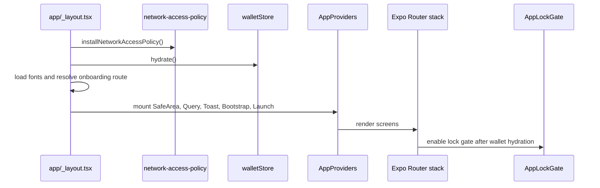
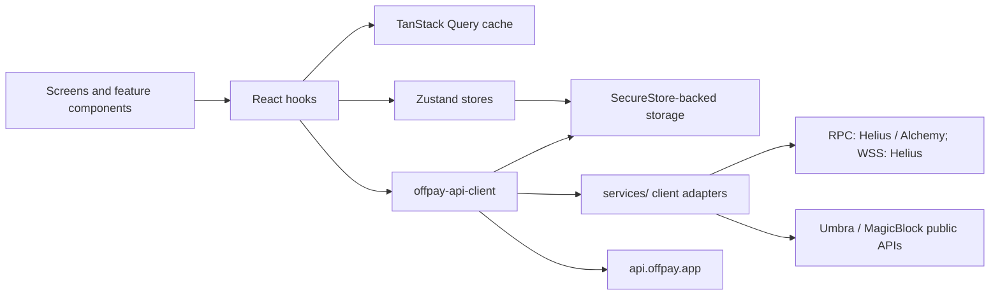

# Architecture

The app is an Expo Router React Native client. `app/_layout.tsx` is the root shell: it installs network access policy, loads fonts, hydrates wallet state, resolves onboarding routing, mounts the native Expo Router stack, and displays global loading/lock surfaces.

## Boot Flow

## Runtime Layers

- `providers/AppProviders.tsx` mounts Safe Area, TanStack Query, app toasts, OffPay bootstrap, and launch orchestration.
- `providers/OffpayBootstrapProvider.tsx` clears API signing state when wallet/network identity changes and provides auth recovery for rotated or invalid request secrets.
- `constants/navigation.ts` provides the native stack options used by the root and nested stacks.
- Feature UI lives under `components/features/`; shared primitives live under `components/ui/`.

## Screen Surface

Tracked routes include:

- tabs: home, scanner, swap, history, settings
- wallet setup: onboarding, username setup, create wallet, restore wallet, security setup
- wallet surfaces: accounts, holdings, token details, transaction details
- payments: private payment, receive payment, nearby wallet scanner
- swap/privacy: advanced swap, Umbra privacy

## State And Data Flow

## Main Stores

- `walletStore`: active wallet list, active wallet id, public key, hydration, create/import/remove flows.
- `preferencesStore`: wallet mode, offline payment settings, display currency, and selected Solana network.
- `offpayAuthStore`: bootstrap/auth readiness state.
- `offpayLaunchStore`: launch readiness and interventions.
- `offlinePaymentStore`: local offline receipts.
- `settlementEngineStore`: queued settlement status.
- `privatePaymentStore`, `umbraPrivacyStore`, `advancedSwapStore`: feature-specific state.
