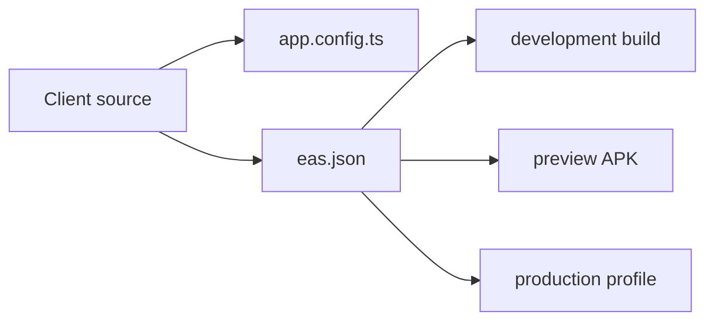

# Build And Testing

## Expo Go Compatibility

**This app cannot run in Expo Go.** It requires a development or production build because it uses native modules that are not included in the Expo Go client.

### Native Modules Requiring Custom Build

The following dependencies use native code that requires a custom native build:

| Package | Purpose | Native Requirement |
| --- | --- | --- |
| `@privy-io/expo` | Authentication & wallet | Native encryption, passkeys |
| `@privy-io/expo-native-extensions` | Privy extensions | Native crypto operations |
| `react-native-ble-manager` | Bluetooth LE | Native BLE APIs |
| `munim-bluetooth` | Bluetooth printer | Native BLE APIs |
| `react-native-passkeys` | WebAuthn passkeys | Android Credential Manager |
| `react-native-mmkv` | Key-value storage | Native storage engine |
| `react-native-nitro-modules` | Native bridge | TurboModules |
| `react-native-worklets` | Worklet runtime | Native threading |
| `lottie-react-native` | Lottie animations | Native animation engine |
| `expo-local-authentication` | Biometrics | Native biometric APIs |
| `expo-secure-store` | Secure storage | Native secure storage |

### Development Workflow

Instead of Expo Go, use:

1. **Development build** (recommended for local dev):
   ```bash
   npm run android  # Android native build
   npm run ios      # iOS native build
   ```

2. **EAS development client**:
   ```bash
   eas build --profile development --platform android
   eas build --profile development --platform ios
   ```

3. **Preview build** (Android APK):
   ```bash
   eas build --profile preview --platform android
   ```

## Native Configuration

`app.config.ts` defines:

- app name `OffPay`, slug `offpay`, scheme `offpay`
- iOS bundle identifier `com.offpay.app`
- Android package `com.offpay.app`
- Expo new architecture enabled
- Bluetooth permissions for offline payment receipt transport
- EAS project id `27e2bc20-d53b-4237-8123-fdc22176e56b`

`eas.json` defines:

- `development`: internal development client with `EXPO_PUBLIC_OFFPAY_ATTESTATION_MODE=prototype`
- `preview`: internal Android APK with the same prototype attestation mode
- `production`: default production profile

## Build Profiles



## Verification Scripts

Available scripts from `package.json`:

| Script | Purpose |
| --- | --- |
| `npm test` | Jest tests with `--runInBand` |
| `npm run test:all` | project test runner |
| `npm run test:all:coverage` | project test runner with coverage |
| `npm run test:all:android` | project test runner with Android export path |
| `npm run lint` | Expo lint |
| `npm run typecheck` | TypeScript no-emit check |
| `npm run verify:hardening` | client hardening guard |

Server-starting scripts exist (`npm start`, `npm run android`, `npm run ios`, `npm run web`) and should only be run when local server execution is intended.

## Hardening Guard

`scripts/verify-client-hardening.js` checks current source files for:

- direct provider/RPC URLs outside allowed files
- non-test `fetch()` usage outside `lib/offpay-api-client.ts`
- source hygiene markers such as mock/stub/TODO patterns
- unstable Zustand selector patterns
- required gitignore entries for planning artifacts
- offline slot spend/reclaim authorization checks
