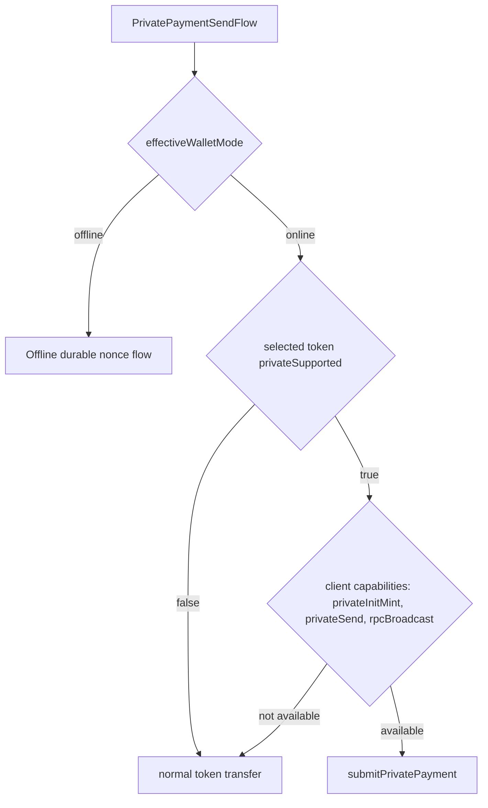
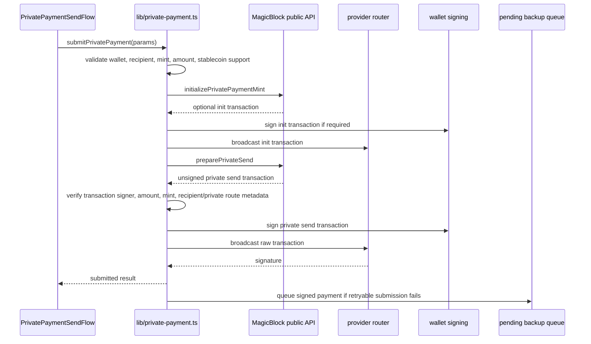

# Private Payments

This document covers the current client-side private payment flow from `components/features/private-payment/PrivatePaymentSendFlow.tsx`, `lib/private-payment.ts`, `lib/stablecoin-policy.ts`, `lib/pending-backup-queue.ts`, and `lib/offpay-api-client.ts`.

## Route Selection

Private payment route options are only offered while online. The MagicBlock route is enabled when capabilities expose `payment.privateInitMint`, `payment.privateSend`, and `payment.rpcBroadcast`.

## Client API Calls

`lib/private-payment.ts` uses these client-side helpers from `lib/offpay-api-client.ts`, backed by `services/private-payments/index.ts` and `services/rpc/index.ts`:

- `initializePrivatePaymentMint()` -> direct MagicBlock public API
- `preparePrivateSend()` -> direct MagicBlock public API
- `broadcastRawTransaction()` -> direct provider-router RPC broadcast

The send flow invalidates private balance, wallet balance, wallet transactions, and pending backup query keys after a private payment result.

## Submit Flow

## Verification Rules

Before signing or broadcasting a prepared private-send transaction, the client verifies:

- active wallet address is a required signer.
- recipient is explicit or the prepared transaction metadata allows a hidden recipient.
- token mint matches the requested mint.
- amount is encoded in the transaction.
- instruction account indexes are within the resolved account-key range.
- native SOL is rejected for private payments.
- token must pass the stablecoin support policy for the selected network.

Mint initialization transactions are also checked for active wallet signer and requested mint.

## Queueing Behavior

If broadcast fails with a retryable provider error, rate limit, upstream outage, or non-`OffpayApiError`, the client queues the signed payment through `enqueuePendingPaymentBackup()`.

Queued result fields include:

- deterministic `txId` derived from the signed transaction hash
- upload status from the pending backup queue
- original recipient, mint, and amount metadata
- optional init transaction signature

Blockhash-expired errors trigger one re-prepare/re-sign attempt before queueing or throwing.

## Offline Branch

When effective wallet mode is offline, `PrivatePaymentSendFlow` does not use the MagicBlock route. It dynamically imports `buildAndEnqueueOfflineStablecoinPayment()`, records local send/receive receipts, invalidates offline slot and pending backup stats, and attempts BLE delivery through `sendOfflineBlePaymentPayload()`.
