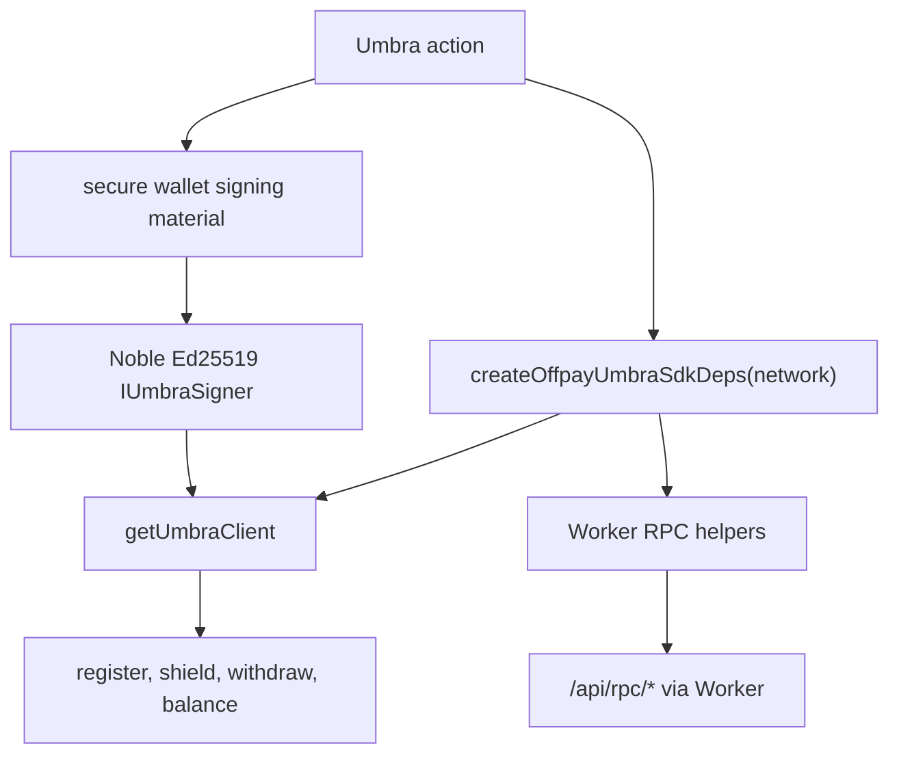
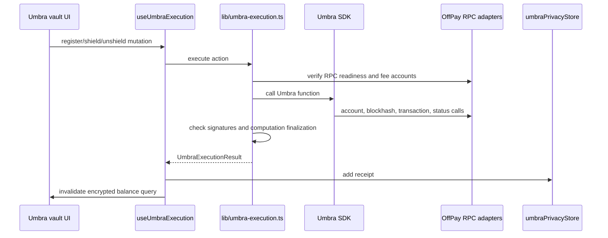

# Umbra SDK Usage

This document covers the current Umbra client integration from `lib/umbra-execution.ts`, `lib/umbra-offpay-providers.ts`, `lib/umbra-supported-tokens.ts`, `hooks/useUmbraExecution.ts`, and `components/features/umbra-vault/`.

The client does not configure a separate Umbra provider secret. Umbra actions use wallet-derived signing material, the Umbra SDK, direct Umbra indexer/relayer calls, and the local OffPay provider router for Solana RPC.

## SDK Entry Points

`lib/umbra-execution.ts` imports these SDK functions:

- `getUmbraClient`
- `getUserRegistrationFunction`
- `getUserAccountQuerierFunction`
- `getEncryptedBalanceQuerierFunction`
- `getPublicBalanceToEncryptedBalanceDirectDepositorFunction`
- `getEncryptedBalanceToPublicBalanceDirectWithdrawerFunction`
- polling RPC helpers for blockhash, transaction forwarding, epoch info, and computation monitoring

## Runtime Construction

`createUmbraRuntime()` derives a 32-byte signing seed from the active wallet mnemonic or private key, verifies it matches the active wallet address, wraps it as an `IUmbraSigner`, creates an Umbra client, and zeroes signing seed bytes after runtime setup.

## OffPay RPC Adapters

`lib/umbra-offpay-providers.ts` keeps Umbra SDK chain access behind the API Worker boundary. It maps SDK RPC needs to client API helpers:

- account info and multiple accounts -> `getRpcAccounts`
- latest blockhash -> `getRpcLatestBlockhash`
- epoch info -> `getRpcEpochInfo`
- slot -> `getRpcSlot`
- transaction send -> `broadcastRawTransaction`
- signature statuses -> `getRpcSignatureStatuses`
- signatures for address -> `getRpcSignaturesForAddress`

The Umbra client is created with the configured OffPay API Worker RPC facade URL. Actual request handling is provided by injected SDK dependencies, which route through `lib/api/offpay-api-client.ts`.

## Supported Networks And Tokens

`lib/umbra-supported-tokens.ts` currently defines:

| Network | Tokens |
| --- | --- |
| `mainnet` | USDC, USDT, wSOL, UMBRA |
| `devnet` | dUSDC, dUSDT |

Token resolution supports symbols, aliases, and explicit mint lookup. Actions fail when the network has no configured Umbra tokens, when a token does not support encrypted balances, or when mixer support is required but unavailable.

## Actions

Current public functions:

- `ensureUmbraEncryptedBalanceRegistration()`: registers/confirms encrypted balance account readiness.
- `shieldTokenWithUmbra()`: deposits public token balance into encrypted balance.
- `withdrawTokenFromUmbra()`: withdraws encrypted balance to public balance.
- `fetchUmbraEncryptedBalances()`: queries encrypted balances for supported tokens.

## Readiness And Safety Checks

Before shield or withdraw, the client:

- verifies client RPC readiness with latest blockhash and slot.
- derives and checks protocol fee accounts for the selected mint/action.
- confirms submitted signatures are visible through client RPC signature status.
- requires Umbra computation callback status to be `finalized`.
- maps SDK errors through `umbra-error-messages.ts`.

`useUmbraExecution()` stores action receipts in `umbraPrivacyStore` and invalidates the encrypted balance query key after successful register, shield, or unshield actions.
