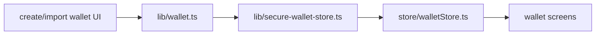
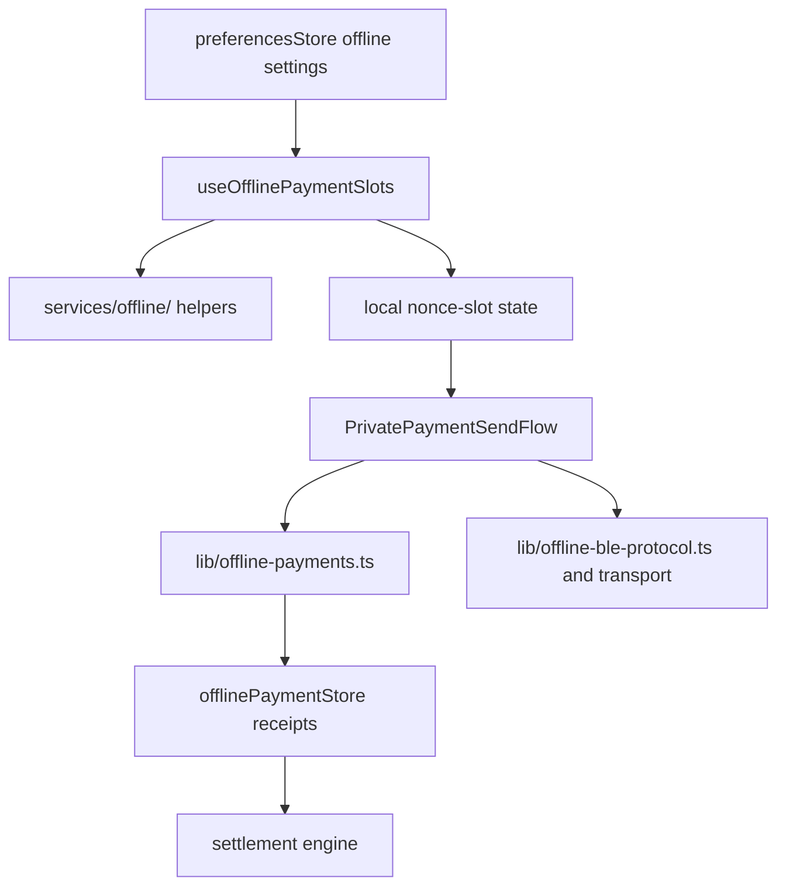

# Wallet, Offline, And Security

## Wallet Storage

`lib/wallet.ts` creates and restores Solana wallets using BIP39 and Ed25519 derivation path `m/44'/501'/0'/0'`. `lib/secure-wallet-store.ts` persists wallet secrets through SecureStore-backed storage. `store/walletStore.ts` keeps active wallet metadata, public key, loading state, and hydration state in memory.

## App Lock

`components/features/security/AppLockGate.tsx` is mounted from `app/_layout.tsx` after onboarding and wallet hydration. Security setup routes live under `app/security-setup/`, and settings security UI lives under `components/features/settings/SecuritySettingsModal.tsx`.

## Wallet Mode

`store/preferencesStore.ts` persists:

- wallet mode: `online` or `offline`
- offline payment enablement
- offline payment pool size
- display currency
- active Solana network

`hooks/useWalletModeState.ts` combines the preferred mode with NetInfo reachability. If connectivity is resolved as unreachable, the effective mode becomes `offline`.

## Offline Flow

## Offline Network Policy

Manual offline mode blocks non-loopback HTTP(S) fetches and pauses query online state. Token logos, provider-router requests, and protected OffPay API requests should not bypass `lib/offpay-api-client.ts` unless a file is explicitly exempted by the hardening script.

## BLE And QR Surfaces

- Nearby wallet scanner UI lives under `app/nearby-wallet-scanner.tsx` and `components/features/ble-scanner/`.
- QR scanning starts from `app/(tabs)/scanner.tsx`.
- Offline BLE protocol and transport logic live in `lib/offline-ble-protocol.ts` and `lib/offline-ble-transport.ts`.
